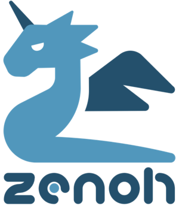

# Eclipse zenoh C# API

[Eclipse zenoh](http://zenoh.io) is an extremely efficient and fault-tolerant [Named Data Networking](http://named-data.net) (NDN) protocol 
that is able to scale down to extremely constrainded devices and networks.

The C# API is for pure clients, in other terms does not support peer-to-peer communication, can be easily tested against a zenoh router running in a Docker container (see https://github.com/eclipse-zenoh/zenoh#how-to-test-it).

-------------------------------
## How to install it

Requirements:
 - The [zenoh-c](https://github.com/eclipse-zenoh/zenoh-c) library must be installed on your host

The Eclipse zenoh C# library is available on NuGet: 

### Supported .NET Standards

The library is configured to target the **.NET 6.0** at minimum.

-------------------------------
## How to build it

Requirements:
 * The [zenoh-c](https://github.com/eclipse-zenoh/zenoh-c) library must be installed on your host
 * A .NET environment

Simply run `dotnet build  Zenoh/`.

-------------------------------
## Running the Examples

The examples are configured to target **net6.0**.

The simplest way to run some of the examples is to get a Docker image of the **zenoh** network router (see https://github.com/eclipse-zenoh/zenoh#how-to-test-it) and then to run the examples on your machine.

Then, run the zenoh-csharp examples following the instructions in [examples/Zenoh/README.md](https://github.com/eclipse-zenoh/zenoh-csharp/blob/master/examples/Zenoh/README.md)
